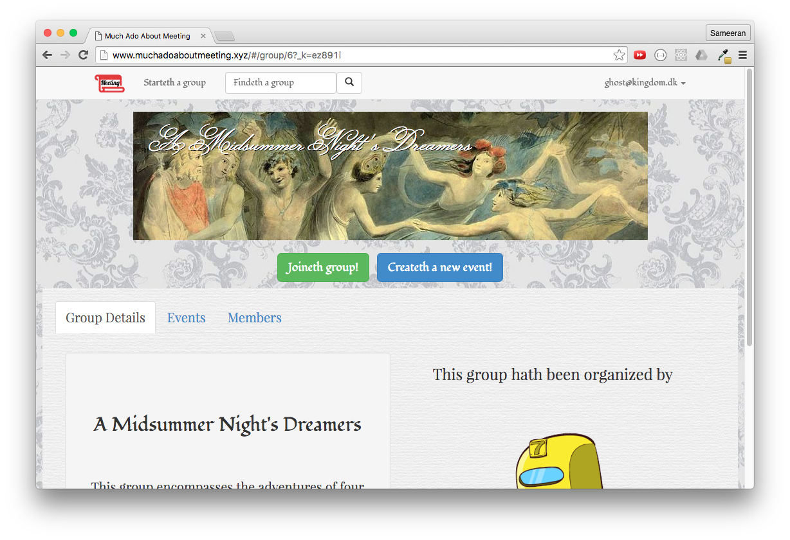
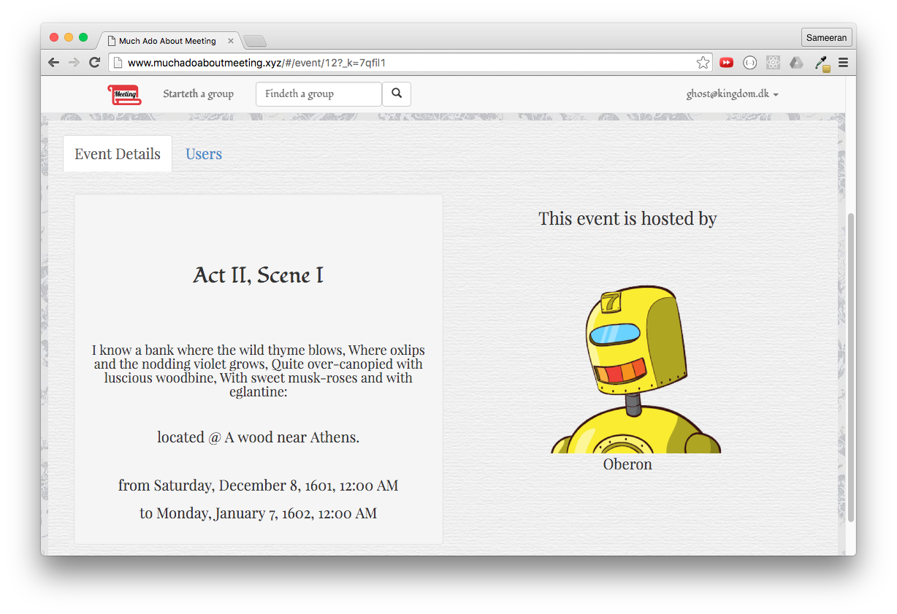

# Much Ado About Meeting

MuchAdoAboutMeeting is a web application inspired by [Meetup](http://www.meetup.com) for thespian robots performing in Shakespeare’s plays. The site allows users who wish to re-enact Shakespearean plays to organize and join Shakespearean groups and events. The front end utilizes the Flux architectural pattern with React.js and consumes a RESTful API served by a Ruby on Rails back end.

View it live at [http://muchadoaboutmeeting.xyz](http://muchadoaboutmeeting.xyz)

## Main functionality

- * Create an account/ Log in / Log out
    * Session authentication occurs on the backend
- * Edit own profile and see group memberships and events that you are attending
- * Browse, join, leave, or create groups
- * Browse, join, leave, or create events within groups
- * View the profiles of other members and see their group memberships

## Design Docs
* [View Wireframes][views]
* [React Components][components]
* [Flux Stores][stores]
* [API endpoints][api-endpoints]
* [DB schema][schema]

[views]: ./docs/views.md
[components]: ./docs/components.md
[stores]: ./docs/stores.md
[api-endpoints]: ./docs/api-endpoints.md
[schema]: ./docs/schema.md

## Languages, Frameworks, Libraries, Etc.

* Ruby on Rails
* React
* Flux
* PostgreSQL
* jQuery
* Gems
  * Bootstrap
  * Jbuilder
  * BCrypt

## Screenshots

Landing page:

Search results:

User details:

Group details:

Event details:

